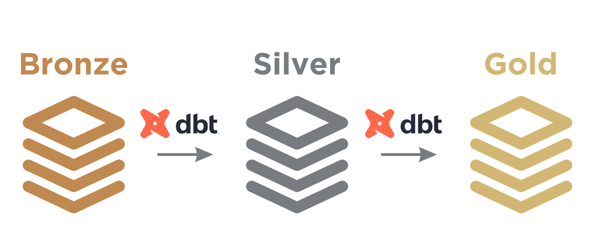
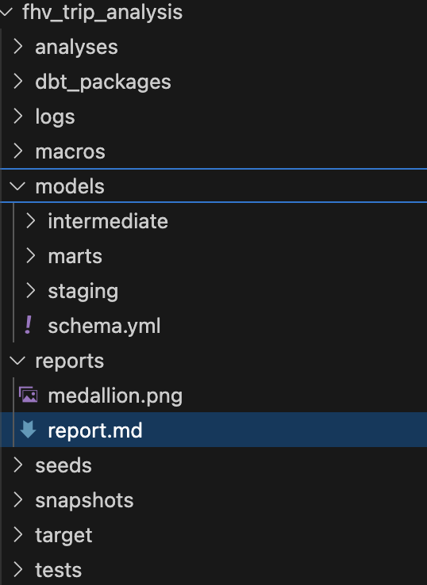
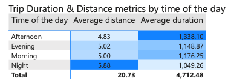

# **Project Report: Trip Analysis with dbt and Power BI**

---

## **1. Introduction**

### **1.1 Objective**
The goal of this project was to design and implement a scalable data pipeline to analyze ride data. The pipeline aimed to:
1. **Clean and validate raw data:** Address quality issues and ensure accuracy.
2. **Generate actionable metrics:** Aggregate insights such as average trip durations, busiest pickup locations, and temporal patterns.
3. **Deliver insights via dashboards:** Enable stakeholders to explore trip data dynamically using Power BI.

### **1.2 Overview**
The project followed a structured methodology:
1. **Understanding Requirements:** Translating business requirements into technical objectives.
2. **Understanding Data:** Exploring raw data to assess quality and structure.
3. **Identifying Problems:** Highlighting gaps in data quality and fragmentation.
4. **Data Modeling:** Implementing the **Medallion Architecture**:
   - Bronze Layer: Raw data ingestion.
   - Silver Layer: Cleaning and enrichment.
   - Gold Layer: Analytics-ready tables for reporting.

The pipeline integrates with PostgreSQL for backend data storage and Power BI for visualizations.

---

## **2. Requirements and Data Understanding**

### **2.1 Translating Requirements**
#### **Business Requirements:**
1. Analyze trip trends by time of day, day of the week, and month.
2. Identify the top 5 busiest pickup zones for operational insights.
3. Provide real-time dashboards for exploring trip metrics.

#### **Technical Implementation:**
1. Aggregate trip metrics by temporal categories (e.g., `time_of_day`, `month`).
2. Rank pickup zones using window functions in SQL.
3. Use Power BI with Direct Query to deliver dynamic, real-time visualizations.

### **2.2 Understanding Data**
The pipeline ingested data from the following sources:
1. **Raw Trip Data (Parquet Files):**
   - Spans multiple months, with fields such as:
     - `pickup_datetime`, `dropoff_datetime`: Trip start and end timestamps.
     - `PULocationID`, `DOLocationID`: Zone identifiers for pickup and dropoff locations.
     - `trip_miles`, `trip_time`: Distance and duration of trips.
2. **Taxi Zone Lookup (CSV File):**
   - Maps `LocationID` to:
     - `Zone`: Name of the area.
     - `Borough`: Administrative region (e.g., Manhattan, Queens).
3. **Taxi Zones Metadata (CSV File):**
   - Provides spatial attributes, including:
     - `geometry`: Shape of the zone.
     - `shape_area`: Size of the zone.

---

## **3. Problems Identified**

### **3.1 Data Quality Issues**
1. **Missing and Invalid Values:**
   - `trip_miles` with values ≤ 0.1 or > 500.
   - `trip_time` exceeding 24 hours or invalid timestamps.
2. **Inconsistent Zone Data:**
   - Duplicate `LocationID`s with varying zone names or geometries.

### **3.2 Fragmented Sources**
1. Parquet files for trip data and CSV files for zone metadata required integration.
2. Metadata files lacked a consistent structure.

---

## **4. Data Modeling and Pipeline Implementation**

The pipeline was designed using the **Medallion Architecture**.

### **4.1 Medallion Architecture Overview**

The architecture is represented as follows:

1. **Bronze Layer:** Raw data ingestion and traceability.
2. **Silver Layer:** Cleaned and validated data with enriched metadata.
3. **Gold Layer:** Aggregated metrics and star schema tables for analytics.

---

### **4.2 Folder and File Structure**

The project files were organized as follows:

**Explanation of Folders:**
1. **`models`:** Contains SQL models for each layer of the Medallion Architecture.
2. **`seeds`:** Stores static CSV reference data (e.g., `taxi_zone_lookup`).
4. **`tests`:** Includes YAML files defining dbt tests for data quality.
5. **`reports`:** Stores documentation such as this report.
6. **Power BI File:** The interactive dashboard.
6. **Power BI pdf:** The dashboard as pdf.

---

### **4.3 Profiles and Targets**
The dbt profiles file was configured with two targets:
1. **Staging:** Used for development and testing of models and transformations.
2. **Production:** Used for finalized models and transformations consumed by dashboards.
   - **Default Target:** The staging environment is set as the default, ensuring changes are tested before moving to production.

---

### **4.4 Materialization Choices**
| **Layer**  | **Materialization** | **Reason**                                                                                   |
|------------|---------------------|---------------------------------------------------------------------------------------------|
| Bronze     | Views               | Lightweight and suitable for on-the-fly transformations of raw data.                        |
| Silver     | Views               | Enables agility in development and reduces storage overhead for intermediate datasets.       |
| Gold       | Tables              | Ensures faster querying and optimized performance for Power BI dashboards.                  |

---

### **4.5 Improvements**
1. **Remove Redundant Joins:**
   - Joining `taxi_zone_lookup.csv` can be avoided since `taxi_zones.csv` contains all necessary information.
2. **Dynamic Metrics in Power BI:**
   - Moving metrics calculations from dbt to Power BI allows for greater flexibility in applying slicers and filters dynamically on the dashboard.
3. **Visualization Enhancements:**
   - Improve dashboard visuals by adding units, refining layout and adding interactivity.
4. **Replace `UNION ALL` for Parquet Files:**
   - Use dbt's [SQL `union()` macro](https://docs.getdbt.com/blog/sql-union-all) to dynamically handle multiple Parquet files.

---

## **5. Power BI Workflow**

### **5.1 Database and Connection**
- **Database:** PostgreSQL.
- **Connection Type:** Direct Query.
  - **Why:** Ensures real-time updates for dashboards as the underlying data changes.

### **5.2 Publishing Workflow**
1. **Staging Workspace:**
   - Dashboards tested with staging data to ensure accuracy.
2. **Production Workspace:**
   - Final dashboards connected to production data for stakeholders.

---

## **6. Main findings and Insights**

### **6.1 Temporal Insights**
- Night trips had higher volume but shorter durations.
- Afternoon trips were longer, reflecting leisure travel.

---

### **6.2 Monthly Trends**
- Trip volumes has the highest value for the month of March.
### **6.3 Location Insights**
- Top pickup zones included transportation hubs like Airports.

---

## **7. Challenges and Resolutions**

### **7.1 Data Quality**
- **Challenge:** Missing and invalid trip data.
- **Resolution:** Applied validation rules and fallback logic in the Silver Layer.

### **7.2 Performance Optimization**
- **Challenge:** Ensuring responsive dashboards.
- **Resolution:** Materialized Gold Layer tables and used Direct Query in Power BI.

---

## **8. Repository and Deliverables**

### **Repository Contents**
1. **dbt Project:**
   - Models for Bronze, Silver, and Gold layers.
   - Tests and seed files.
2. **Power BI Dashboard:** as PDF and `.pbix` file.
3. **Markdown Report:** `report.md`.
